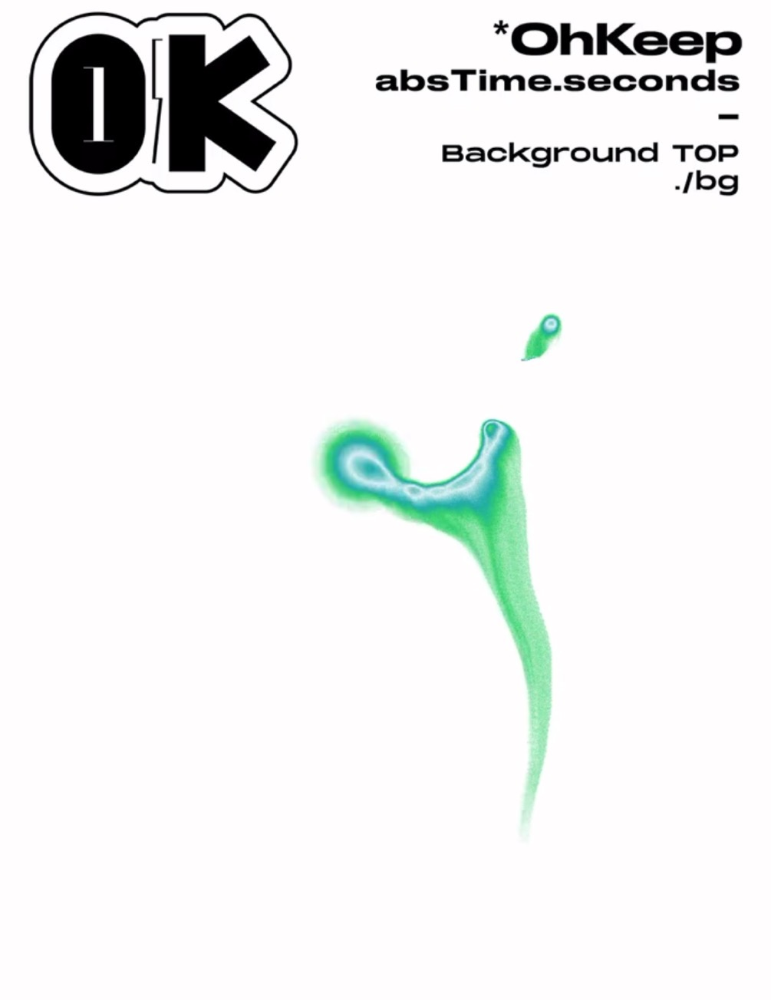
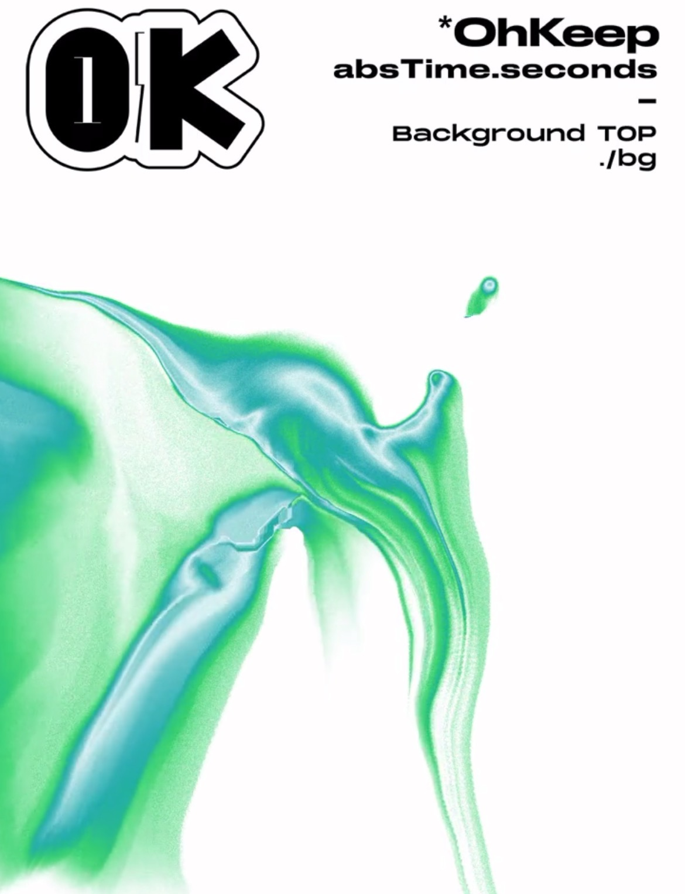
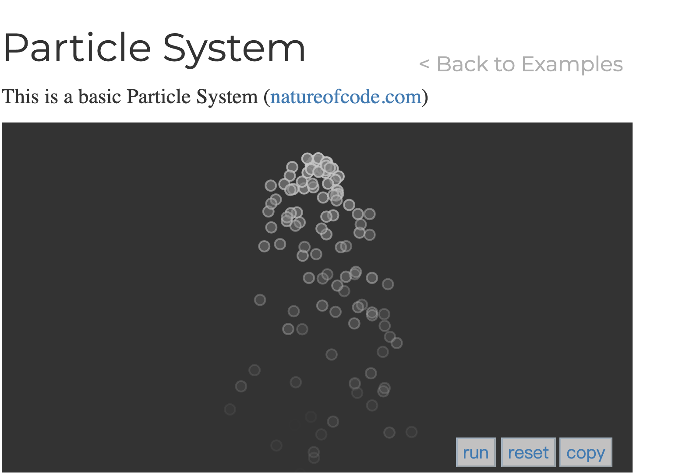
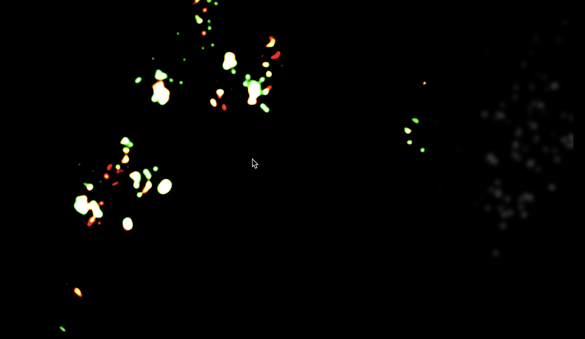

# yali0914_9103_tut4

# this is bold

# Header 1
## Header 2
### Header 3
#### Header 4
##### Header 5
###### Header 6

# Quiz 8
## Combine Artwork with Quicksand Effect

### Which aspect to incorporate
The design is to take the presentation of quicksand and the interaction form where the user clicks in real-time to change the quicksand's direction into the design.

### Presentation and interaction
By presenting the artwork as a sand painting, the sand flows randomly at first, and the audience can make the sand flow in a specific direction and then reshape the artwork by clicking.

### Why Beneficial
It allows the audience to redraw the artwork immersively enhancing engagement and joyment in appreciating artworks.

### Main technique to help achieve the desired effect
The particle system is primarily used, and the sample code is linked below. By setting the particles' physical properties and movement rules, the effect of quicksand can be simulated. By creating a particle object at the mouse's current position clicked, the draw function redraws each time, the object's position is updated and then the object is redrawn. Thus, the effect of the user interaction of redrawing the artwork in the sand painting way can be achieved. 

[particle system1](https://p5js.org/examples/simulate-particle-system.html)

[particle system2](https://github.com/Vikram-Bhat/CodingChallengeContributions/blob/main/particlesystem.pde)

### Further exploration
It also needs more effort to simulate the quicksand by the particle system and shaders and enhance the performance.

